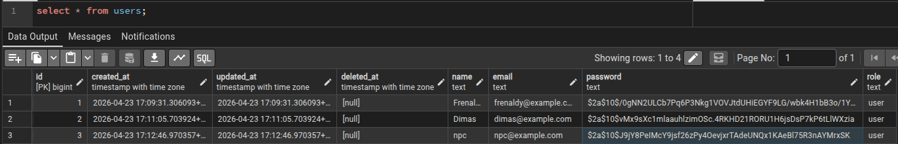

# Laporan Pengerjaan Tugas Backend Workshop Laboratorion Algoritma & Pemrograman Day 2

## Deskripsi

Project ini merupakan tugas praktik atau handson pada workshop laboratorium algoritma dan pemrograman. Secara garis besar project ini merupakan sistem REST api untuk manajemen user yang dibangun dengan bahasa utama golang, GIN Framework, dan G-ORM.

---

## Tech Stack

- **Go** — Bahasa pemrograman utama
- **Gin** — Web framework untuk routing & HTTP handler
- **GORM** — ORM untuk interaksi dengan database
- **JWT** — Autentikasi berbasis token
- **PostgreSQL** — Database (sesuaikan dengan `.env`)
- **Docker** — Containerization (Opsional)

## Struktur Folder

```
.
├── cmd                                 # Entry aplikasi (go run ...)
│   └── main.go                         
├── config                              # Konfigurasi database
│   └── database.go                     
├── database
│   └── entities
│       ├── common.go                   # Definisi model / tabel untuk database
│       └── user_entity.go
├── docker-compose.yml
├── go.mod
├── go.sum
├── middlewares                         # Middlewares
│   └── authentication.go
├── modules
│   ├── auth                            # Autentifikasi
│   │   ├── controller
│   │   │   └── auth_controller.go      
│   │   ├── dto
│   │   │   └── auth_dto.go
│   │   ├── routes.go
│   │   ├── service
│   │   │   ├── auth_service.go
│   │   │   └── jwt_service.go
│   │   └── validation
│   │       └── auth_validation.go
│   └── user                            # Modul user
│       ├── controller
│       │   └── user_controller.go
│       ├── dto
│       │   └── user_dto.go
│       ├── repository
│       │   └── user_repository.go
│       ├── routes.go
│       ├── service
│       │   └── user_service.go
│       └── validation
│           └── user_validation.go
├── pkg
│   ├── helpers                         # Helper Function
│   │   └── password.go                 
│   └── utils                           # Utility (Response formatter)
│       └── response.go
└── README.md

21 directories, 23 files

```

## Setup dan Instalasi

### 1. Clone Repository

```
https://github.com/FrenaldyH/be-alpro
cd be-alpro
```

### 2. Konfigurasi .env

```
touch .env
```

Isi file `.env` sesuai environment:

```
DB_HOST=127.0.0.1
DB_USER=[YOUR_DATABASE_USERNAME]
DB_PASSWORD=[YOUR_DATABASE_PASSWORD]
DB_NAME=[YOUR_DATABASE_NAME]
DB_PORT=5432
```

### Install dependencies

```
go mod tidy
```

### Jalankan database   

```
sudo systemctl start postgresql
sudo systemctl status postgresql
```

## API Endpoints

| Method | Endpoint | Deskripsi | 
|--------|----------|-----------|
| POST | /api/auth/login | Authentifikasi Login | 
| POST | /api/users | Membuat User Baru | 
| GET | /api/users/:id | Tampilkan User Berdasarkan ID | 
| GET | /api/users | Tampilkan Semua User | 

## Dokumentasi API

### POST `/api/users`

**Request Body:**

```
{
    "name": "pisi",
    "email": "pisi@example.com",
    "password": "password123"
}
```

**Response Sukses:**
```
{
    "data": {
        "id": 7,
        "created_at": "2026-04-23T21:25:02.649636775+07:00",
        "updated_at": "2026-04-23T21:25:02.649636775+07:00",
        "deleted_at": null,
        "name": "pisi",
        "email": "pisi@example.com",
        "role": "user"
    },
    "message": "User berhasil dibuat",
    "status": "success"
}
```

**Response Jika Email Sudah Ditemukan:**
```
{
    "message": "Gagal membuat user",
    "status": "error"
}
```

**Tampilan Database:**



### GET `/api/users`

**Response Sukses:**

```
{
    "data": [
        {
            "id": 1,
            "created_at": "2026-04-23T17:09:31.306093+07:00",
            "updated_at": "2026-04-23T17:09:31.306093+07:00",
            "deleted_at": null,
            "name": "Frenaldy",
            "email": "frenaldy@example.com",
            "role": "user"
        },
        {
            "id": 2,
            "created_at": "2026-04-23T17:11:05.703924+07:00",
            "updated_at": "2026-04-23T17:11:05.703924+07:00",
            "deleted_at": null,
            "name": "Dimas",
            "email": "dimas@example.com",
            "role": "user"
        },
        {
            "id": 3,
            "created_at": "2026-04-23T17:12:46.970357+07:00",
            "updated_at": "2026-04-23T17:12:46.970357+07:00",
            "deleted_at": null,
            "name": "npc",
            "email": "npc@example.com",
            "role": "user"
        },
        {
            "id": 7,
            "created_at": "2026-04-23T21:25:02.649636+07:00",
            "updated_at": "2026-04-23T21:25:02.649636+07:00",
            "deleted_at": null,
            "name": "pisi",
            "email": "pisi@example.com",
            "role": "user"
        }
    ],
    "message": "Berhasil fetch data users",
    "status": "success"
}
```

### GET `api/users/:id`

**Response Sukses:**

```
{
    "data": {
        "id": 1,
        "created_at": "2026-04-23T17:09:31.306093+07:00",
        "updated_at": "2026-04-23T17:09:31.306093+07:00",
        "deleted_at": null,
        "name": "Frenaldy",
        "email": "frenaldy@example.com",
        "role": "user"
    },
    "message": "berhasil fetch data user",
    "status": "success"
}
```

**Response Gagal - User Tidak Ditemukan (404):**

```
{
    "message": "id tidak ditemukan",
    "status": "error"
}
```

**Response Gagal - ID Tidak Valid (400):

```
{
    "message": "id tidak valid",
    "status": "error"
}
```

## Arsitektur
 
Request masuk diproses melalui lapisan berikut:
 
```
HTTP Request
    ↓
Router (routes.go)
    ↓
Controller          → Parsing request, mengirim response
    ↓
Service             → Logika bisnis, validasi aturan
    ↓
Repository          → Query ke database via GORM
    ↓
Database
```


